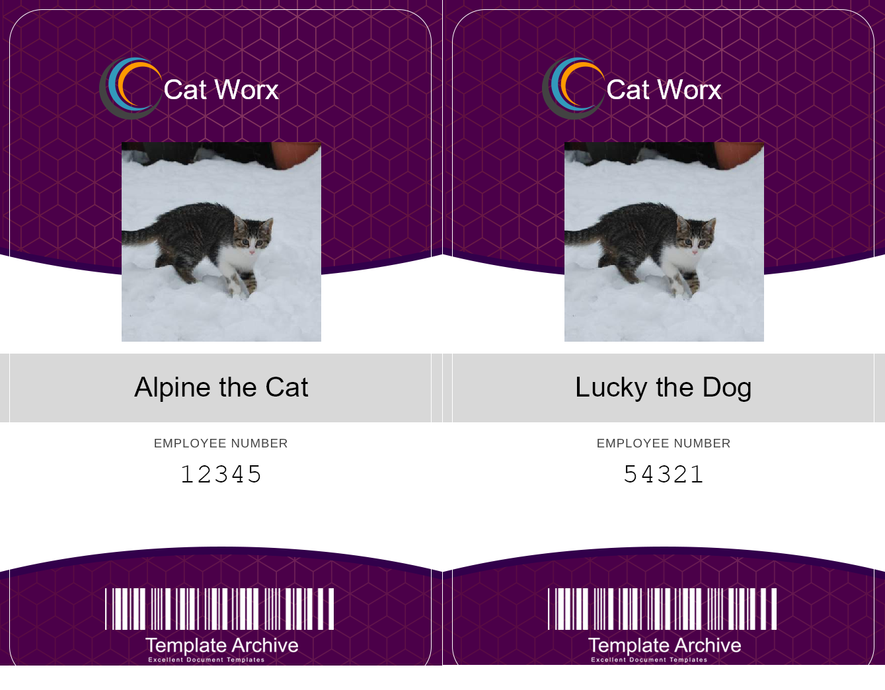
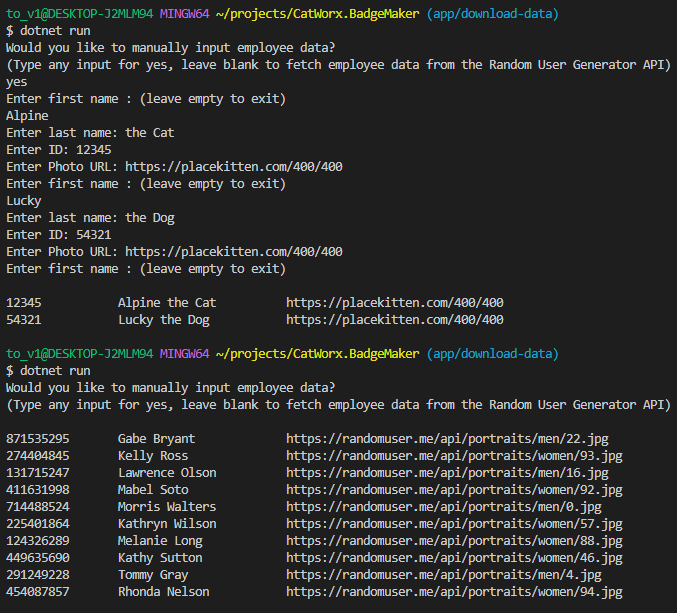

  # CatWorx Badge Generator
  
  This C# and ASP.NET Core CLI application uses SkiaSharp and Newtonsoft.Json to generate security badges for employees at CatWorx. Badges include the company's name, the employee's full name and their id number, along with a photo of the employee. Users can choose to manually enter employee data or fetch employee data from the Random User Generator API to randomly generate badges for 10 hypothetical employees. The application outputs both a CSV file of employees and a unique PNG image for each employee's badge.
  
  ## Table of Contents
  
  * [Installation](#installation)
  * [Built With](#built)
  * [Usage Information](#usage)
  * [Authors & Acknowledgements](#credits)
  * [Contact](#questions)
  
  ## Installation
  After cloning the repository, use the command "dotnet run" to start the application.

  ## Built With<a name="built">
  * C#
  * ASP.Net Core
  * SkiaSharp
  * Newtonsoft.Json (JSON.NET)
  * Random User Generator API
  * Place Kitten
  
  ## Usage Information
  
  This application is hardcoded to create badges for CatWorx employees, but the Employee model can be updated on line 59 to return any company's name. 
     
     
    
  ## Authors & Acknowledgements
  
  © 2020 - 2022 Trilogy Education Services, a 2U, Inc. brand. All Rights Reserved.
  
  Made by [TOVTC](https://github.com/TOVTC).
  
  ## Questions?
  Contact repository author via [GitHub](https://github.com/TOVTC). 
    
  
  